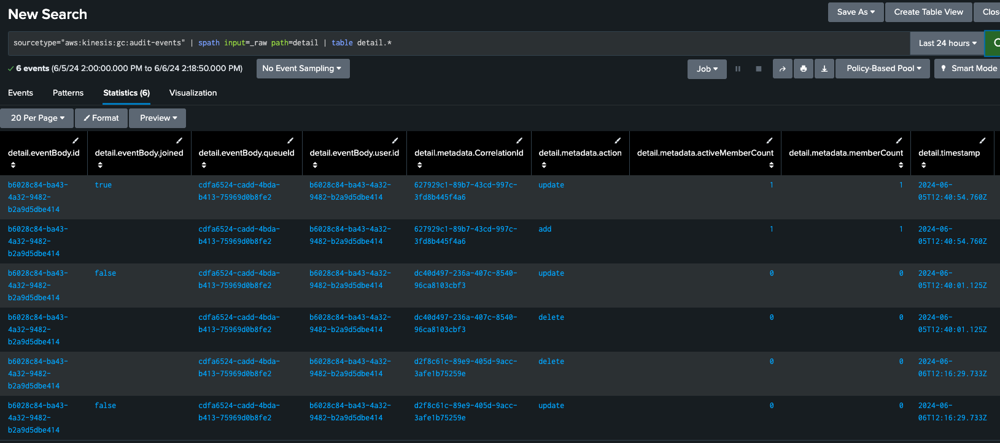
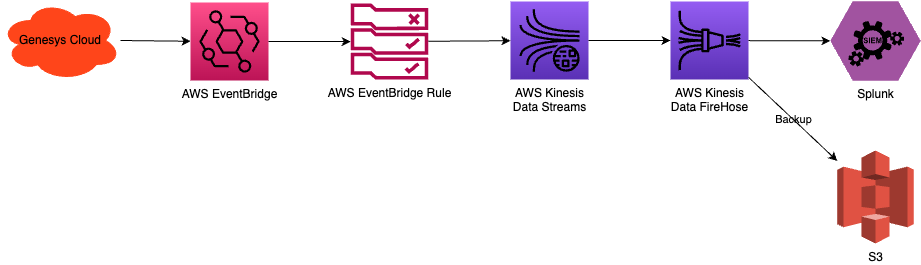

# Genesys Cloud Audit Events to Splunk

https://github.com/PierrickI3/GenesysCloud-Audit-Events-To-Splunk/assets/7140338/1f41eea2-49aa-4d8a-a53a-409fd296bf05

> This is an **art of the possible** solution and should not be used in production without thorough testing.

This repository provides an example of how Genesys Cloud audits can be forwarded to a Splunk instance. It includes a complete terraform configuration that creates a Genesys Cloud Event Bridge integration, writes events from the integration into a Kinesis stream & S3 for backup purposes. It finally includes instructions on how to configure Splunk to read the events from the Kinesis stream.



The integration works as follows:



## Requirements

- A Genesys Cloud organization
- An AWS account with permissions to access the following services:
  - AWS Identity and Access Management (IAM)
  - AWS S3 (only used for backup purposes)
  - AWS Kinesis
  - AWS EventBridge
- AWS credentials: follow [these steps](https://docs.aws.amazon.com/cli/latest/userguide/cli-chap-getting-started.html) to install the AWS CLI on your machine and connect to your account
- Terraform: [Installation instructions](https://developer.hashicorp.com/terraform/install)
- A Genesys Cloud OAuth Client (Client Credentials) with master admin role: [Instructions](https://help.mypurecloud.com/articles/create-an-oauth-client/)
- Splunk with the [Splunk Add-on for Amazon Web Services (AWS)](https://splunkbase.splunk.com/app/1876) installed. See [this page](https://splunk.github.io/splunk-add-on-for-amazon-web-services/SplunkCloud/) for installation instructions. The add-on can be a bit difficult to find. You can search for `aws` and check the `add-on` filter to narrow down the list of add-ons.

## Getting Started

### Setup Credentials

In order to run and deploy, follow these steps:

- Make a copy of the `setenv-example.sh` and rename it `setenv.sh`
- Edit the `setenv.sh` and set the required environment variables values then save & close the file
- Run the `setenv.sh` script to set the environment variables: `source ./setenv.sh`
- Edit the `terraform/terraform.tfvars` file
  - Update the `aws_account_region` field to match your AWS region (e.g. `us-east-1`) then
  - Update the `s3_bucket_name` to a unique name withing your AWS region (e.g. `analytics-gc-audits-<YOUR COMPANY NAME>`). This is an AWS requirement which states that S3 buckets should have unique names within the entire AWS region you have selected.
  - Update the list of topics you want to monitor. The full list is available [here](https://developer.genesys.cloud/notificationsalerts/notifications/available-topics). Select the `Event Bridge` filter to see the available topics that are supported by this integration.
  - Save & close the file
- If you have multiple AWS profiles on your machine (other than `default`, you can check this by running `cat ~/.aws/credentials`), do the following:
  - Edit the `terraform/provider.tf` file
  - Update the `profile` field to match the name of your AWS profile
  - Save & close the file

### Deployment

- Run `source ./setenv.sh` to set the appropriate environment variables
- cd into the `terraform` folder
  - Run `terraform init`. This will initialize the terraform providers (`genesyscloud` and `aws`)
  - Run `terraform apply` (or `terraform apply --auto-approve` to avoid being prompted to confirm the changes)

### Splunk

- Login to your Splunk instance
- Open the main page for the `Splunk Add-on for AWS`
  - Click on the `Configuration` tab to add your AWS account
    - Click on `Add` and enter your AWS Access Key and Secret Key
  - Click on the `Inputs` tab
  - Click on `Create New Input` and select `Custom Data Type\Kinesis`
    - Enter a name for the input (e.g. `Genesys Cloud Kiensis Stream Audit Events`)
    - Select your `AWS Account` and `AWS Region`
    - Select the `aws-eventbridge-kinesis-stream` Kinesis stream
    - Leave `Record Format` and `Encoding` blank
    - Set the `Source Type` to `aws:kinesis:gc:audit-events`. This step is optional but recommended to easily identify the data
    - Set the `Index` to `main`
- Trigger an action in Genesys Cloud that should generate an event.
- Go back to Splunk and search for the event:

```psl
index=main sourcetype="aws:kinesis:gc:audit-events"
```

- You can also search and format the audit events as a table with the following queries:

```psl
  sourcetype="aws:kinesis:gc:audit-events" | spath input=_raw path=detail | table detail.*
  sourcetype="aws:kinesis:gc:audit-events" | table id detail.topicName detail.eventBody.queueId detail.metadata.action detail.eventBody.user.id
```

## Troubleshooting

- If the terraform script hangs after these 2 lines:

```console
module.aws_account_identity.data.aws_caller_identity.current: Reading...
module.aws_account_identity.data.aws_caller_identity.current: Read complete after 0s [id=xxxxxxxxxxxx]
```

Make sure you have executed the `source ./setenv.sh` command to set the environment variables.

- If you get a 409 error (BucketAlreadyExists), this means that the name of the bucket terraform is trying to create is not unique within your AWS region. Open the `terraform.tfvars` file and set the `s3_bucket_name` to a unique value.
- If the script is stuck, make sure you have set the environment variables by running `source ./setenv.sh` and that you have the required permissions to create the resources in AWS.

## Cleanup

To delete everything that was created, run `terraform destroy` from the `terraform` folder then remove your queries and dashboards from Splunk manually.
